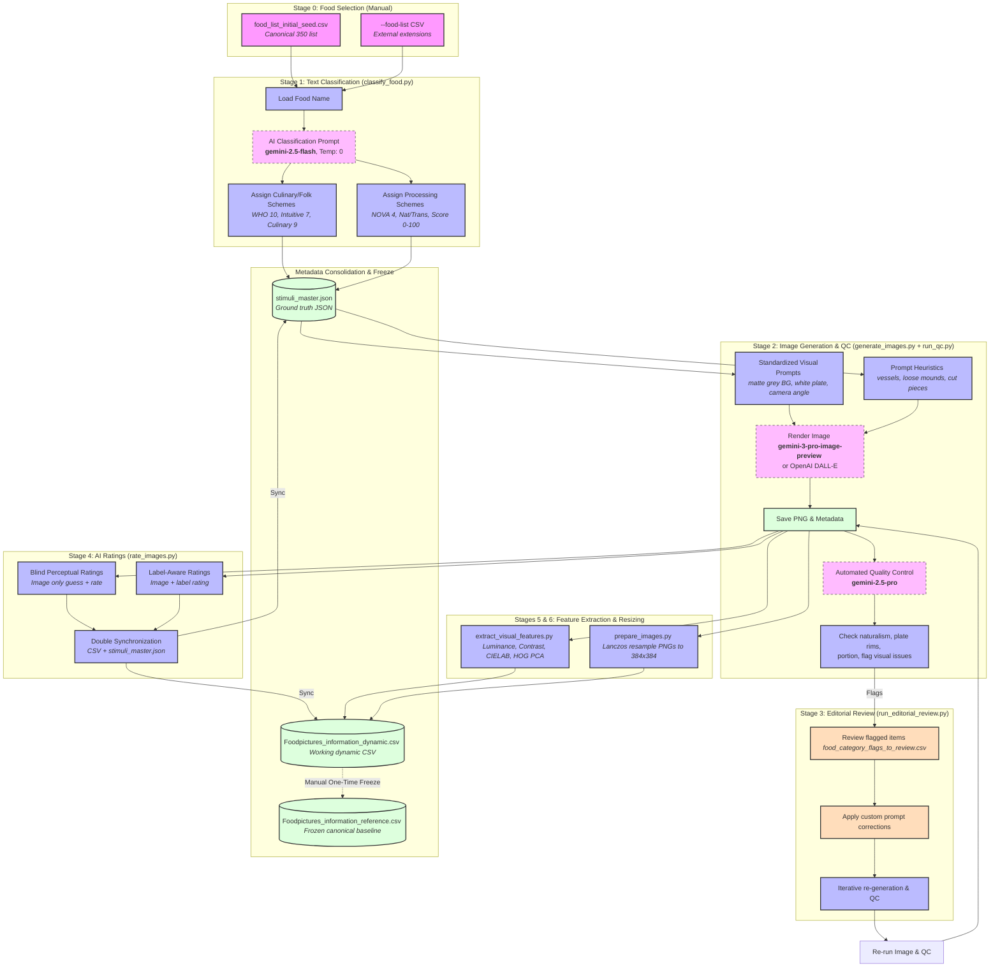

# PAFID: Public AI-Generated Food Image Database Pipeline

**Repository:** https://github.com/ThomasSydneyEDU/PAFID  
**Companion paper:** Stella et al. (in preparation)

PAFID is a modular, extensible pipeline for generating, validating, and rating photorealistic food stimuli using Generative AI. This repository provides the tools to extend the existing 350-item canonical database with new cultural or nutritional variants.

## Pipeline Overview

PAFID runs as **seven sequential stages (Stage 0 through Stage 6)**, all resumable and incremental by default — every script skips items that are already complete, so an interrupted run can simply be restarted. The table below is the authoritative stage list; the [Usage Pipeline](#usage-pipeline) section gives the runnable command for each.

| Stage | Script / Executor | What it does |
|---|---|---|
| 0. Food Selection | *Manual* | Name the food stimuli and compile the seed list (`data/food_list_initial_seed.csv`) |
| 1. Text Classification | `classify_food.py` | Assigns taxonomic categories (WHO 10, Intuitive 7, Culinary 9) and processing attributes (NOVA 4, Natural-vs-transformed, 0–100 score) from the food name |
| 2. Image Generation & QC | `generate_images.py` + `run_qc.py` | Renders standardized 1024×1024 images, then immediately audits them and writes neutral captions + flags |
| 3. Editorial Review | `run_editorial_review.py` | Human-in-the-loop: applies author-written fixes and re-renders flagged items in a closed loop |
| 4. AI Ratings | `rate_images.py` | Separate, scientifically blinded **blind** and **aware** perceptual ratings |
| 5. Visual Features | `extract_visual_features.py` | Low-level vision stats (luminance, contrast, CIELAB, edge energy, HOG PCs) |
| 6. Prepare Images | `prepare_images.py` | Lanczos-resamples images down to 384×384 for experiment deployment |

All metadata consolidates into two artefacts: `data/Foodpictures_information_dynamic.csv` (the working dataset) and `rendered_images/stimuli_master.json` (the per-item ground truth).

### Workflow diagram



### Why it's structured this way

- **Blind and aware ratings are separate API calls (Stage 4).** In a single combined prompt, self-attention on the text label would leak into the blind evaluation. Running them separately keeps the blind condition strictly blind — this is methodologically essential.
- **Generation and QC are combined into one stage (Stage 2).** Coupling rendering with its audit creates a clean closed-loop feedback phase: QC flags feed directly into the Stage 3 editorial review, which re-renders and re-checks until issues are resolved.
- **Classification is isolated from generation (Stage 1 vs 2).** Decoupling metadata assignment from image rendering — and physical image QC from subjective ratings — keeps each concern auditable and independently re-runnable.

## Directory Structure

```text
PAFID/
├── src/                       # Core pipeline scripts
│   ├── classify_food.py       # Classifies food items into categories and processing levels (Stage 1)
│   ├── generate_images.py     # Generates standardized culinary images from food lists (Stage 2)
│   ├── run_qc.py              # Automated Quality Control checklist (Stage 2)
│   ├── prepare_images.py      # Resizes and packages images for experiments (Stage 6)
│   ├── rate_images.py         # Conducts blind and aware AI ratings (Stage 4)
│   ├── extract_visual_features.py  # Computes low-level visual statistics (Stage 5)
│   ├── run_editorial_review.py  # Iterative image/label review (regenerate or preview corrections) (Stage 3)
│   ├── apply_corrections.py  # Commits confirmed label corrections to master + dynamic CSV
│   ├── reset_pipeline.py     # Resets the database to the 350-item canonical baseline
│   └── generate_nonfood_stimuli.py  # Generates non-food object foils (not part of PAFID release)
├── data/                      # Input lists and metadata
│   ├── food_list_initial_seed.csv               # Seed list (Food column only)
│   ├── Foodpictures_information_dynamic.csv     # Working metadata (pipeline output)
│   ├── Foodpictures_information_reference.csv   # Static 350-item baseline
│   ├── human_ratings.csv                        # Aggregate human ratings (mean per image)
│   ├── human_ratings_individual.csv             # Trial-level human ratings (per participant × image)
│   └── QC/                                      # Category audit and correction files
│       ├── food_category_flags_to_review.csv    # 38-item audit (action/confirmed_value/generation_notes columns)
│       └── category_corrections.csv             # Confirmed manual corrections (applied via apply_corrections.py)
├── assets/                    # Reference assets (e.g. style guides, design notes)
├── rendered_images/           # Generated high-res images and metadata
├── resized_images/            # Experiment-ready images
├── run_pipeline.sh            # Main pipeline runner (use --safe-rerun to skip image generation)
└── requirements.txt           # Python dependencies
```

## Setup

### 1. Download the Code
You can download the code using Git or by downloading a ZIP file.

**Option A: Using Git**
```bash
git clone https://github.com/ThomasSydneyEDU/PAFID.git
cd PAFID
```

**Option B: Downloading as a ZIP**
1. Click the green "**Code**" button at the top of the GitHub repository page.
2. Select "**Download ZIP**".
3. Extract the ZIP file to your computer.
4. Open your terminal (Mac/Linux) or Command Prompt/PowerShell (Windows).
5. Navigate to the extracted `PAFID` folder using the `cd` command (e.g., `cd Downloads/PAFID-main`).

### 2. Set Up a Virtual Environment (Recommended)
To avoid conflicts with other Python projects on your computer, create a virtual environment.

**Create the virtual environment:**
```bash
python -m venv venv
```
*(If `python` doesn't work, try `python3 -m venv venv`)*

**Activate the virtual environment:**
*   **Mac/Linux:**
    ```bash
    source venv/bin/activate
    ```
*   **Windows (Command Prompt):**
    ```cmd
    venv\Scripts\activate.bat
    ```
*   **Windows (PowerShell):**
    ```powershell
    .\venv\Scripts\Activate.ps1
    ```

### 3. Install Dependencies
Once your virtual environment is active (you should see `(venv)` in your command line prompt), install the required packages:
```bash
pip install -r requirements.txt
```

### 4. Set Up Google Gemini Access

The pipeline uses **Google Gemini** for image generation and automated food labelling. Two authentication methods are supported — see [GOOGLE_API_SETUP.md](GOOGLE_API_SETUP.md) for full instructions.

#### Option A — Vertex AI (Recommended)

Uses your Google Cloud project credentials. No API key required.

```bash
gcloud auth application-default login
gcloud auth application-default set-quota-project your-project-id
```

Then set these environment variables (add to `~/.zshrc` or `~/.bash_profile` to make permanent):

*   **Mac/Linux:**
    ```bash
    export GOOGLE_CLOUD_PROJECT="your-project-id"
    export GOOGLE_CLOUD_LOCATION="global"
    export GOOGLE_GENAI_USE_VERTEXAI="True"
    ```
*   **Windows (PowerShell):**
    ```powershell
    [System.Environment]::SetEnvironmentVariable("GOOGLE_CLOUD_PROJECT", "your-project-id", "User")
    [System.Environment]::SetEnvironmentVariable("GOOGLE_CLOUD_LOCATION", "global", "User")
    [System.Environment]::SetEnvironmentVariable("GOOGLE_GENAI_USE_VERTEXAI", "True", "User")
    ```

#### Option B — AI Studio API Key

For quick personal use. Go to [Google AI Studio](https://aistudio.google.com/app/apikey), sign in, and create an API key. Then:

*   **Mac/Linux:**
    ```bash
    export GEMINI_API_KEY="your-gemini-api-key"
    ```
*   **Windows (Command Prompt):**
    ```cmd
    set GEMINI_API_KEY=your-gemini-api-key
    ```
*   **Windows (PowerShell):**
    ```powershell
    $env:GEMINI_API_KEY="your-gemini-api-key"
    ```

*(Optional)* If you plan to use OpenAI's models for image generation instead, set your `OPENAI_API_KEY` in the same manner.

## Data Management

This repository includes two versions of the master metadata:
*   `data/Foodpictures_information_dynamic.csv`: The **working version** that the pipeline updates with new ratings and visual features.
*   `data/Foodpictures_information_reference.csv`: A **static copy** of the original study results (350 items) for alignment and reference.

Two human ratings files are also included:
*   `data/human_ratings.csv`: **Aggregate ratings** — mean scores per image across all participants. This is what the pipeline merges into `Foodpictures_information_dynamic.csv`.
*   `data/human_ratings_individual.csv`: **Trial-level ratings** — one row per participant × image (126 participants, ~7,500 rows). Use this for individual-differences analyses or recomputing aggregates with different exclusion criteria.

## AI-Assigned Labels

Rather than requiring labels to be specified manually in the seed list, the pipeline uses Gemini to assign six labels per food item automatically:

| Column | Description |
|---|---|
| `Category_WHO_10` | WHO/FAO food category (10 classes: Fruits, Vegetables, Meat, Fish, Dairy and eggs, Bakery wares and cereals, Confectionery and sweets, Beverages, Ready-to-eat savories, Prepared foods) |
| `Category_Intuitive_7` | AI-assigned 7-group intuitive category (e.g., Vegetable, Dessert) |
| `Category_Culinary_9` | AI-assigned 9-group culinary category (e.g., Produce - Sweet, Composite Meals) |
| `Natural_vs_transformed` | Whether the food is **Natural** (identifiable as a single biological source, even if minimally prepared) or **Transformed** (substantially altered through processing, combination, or cooking) |
| `Transformation_score` | Continuous score 0–100 reflecting degree of processing (0–10 = raw/whole; 85–100 = highly manufactured) |
| `Category_NOVA_4` | NOVA food-processing group 1–4 (Monteiro et al., 2016): 1 = unprocessed/minimally processed, 2 = processed culinary ingredients, 3 = processed foods, 4 = ultra-processed. Classified with a separate prompt (ported from the original manual batch protocol) and versioned independently of the other four schemes, so updating one prompt does not re-trigger the other. |

Classification uses `gemini-2.5-flash` (temperature 0) via a single text call per food item and does not depend on the generated image.

## Usage Pipeline

The automated pipeline consists of sequential, modular steps. All pipeline scripts are resumable and incremental, skipping already completed items by default.

### 1. Classify Food Items (Stage 1)
To classify taxonomic categories (culinary/folk) and processing attributes (NOVA, Transformed, and continuous transformation score) of your food list before generating images:
```bash
python3 src/classify_food.py --limit 5
```
*   Reads food names from `data/food_list_initial_seed.csv`.
*   Calls Gemini text API to assign categories and NOVA levels.
*   Outputs/updates metadata inside `rendered_images/stimuli_master.json` in-place, creating a `.json.bak` backup.
*   **Useful flags:**
    ```bash
    python3 src/classify_food.py --food "Apple (raw)"   # single item
    python3 src/classify_food.py --limit 10            # first N items
    ```

### 2. Generate Stimulus Images & Quality Control (Stage 2)
To build visual prompts using structural and culinary heuristics (plate clauses, vessel, granular loose mounds) and render the standardized culinary images:
```bash
python3 src/generate_images.py --limit 5
```
*   Reads expected classifications from `stimuli_master.json` and generates the corresponding high-resolution `1024x1024` PNG images.
*   **Safe Defaults**: By default, the script will **skip** existing PNG files in `rendered_images/`. Use `--overwrite` only if you explicitly wish to replace an image.
*   **Outputs**: Saves high-res images to `rendered_images/` and appends rendering details (model, prompts, size, seed) into `stimuli_master.json`.

> **Resumable by default.** All pipeline steps are safe to re-run after an interruption or API failure — each script skips items that are already complete. For classification, it means the entry carries the current prompt version stamp. For generation, it means the PNG file already exists. Simply re-run the same command to pick up where you left off. Use `--overwrite` only when you explicitly want to re-process everything.

**Quality control (same stage).** Immediately after rendering, audit the generated images and get "aware" AI ratings (where the AI knows the food label):
```bash
python src/run_qc.py --stimuli-dir rendered_images/
```
*   **Merges results** into `data/Foodpictures_information_dynamic.csv`.
*   Flags problem items into `data/QC/food_category_flags_to_review.csv` and `qc_issues.json` for the editorial review in Stage 3.

### 3. Editorial Review (Stage 3)
Human-in-the-loop correction of flagged items. Authors inspect the visual flags from Stage 2 and write prompt fixes into the `generation_notes` column of `data/QC/food_category_flags_to_review.csv`, then apply them in a closed loop:
```bash
python src/run_editorial_review.py
```
*   Reads the manual suggestions, re-renders the affected images with the custom prompt additions, and re-runs QC on them to verify the fixes.
*   Optional step — only needed when Stage 2 surfaces issues you want to correct. The canonical 350 ship with 38 flagged items deliberately left uncorrected (see [Known Issues](#known-issues)).

### 4. Blind AI Ratings (Stage 4)
Acquire "blind" AI ratings (where the AI only sees the image and must guess what the food is):
```bash
python src/rate_images.py --stimuli-dir rendered_images/
```
*   **Merges results** into `data/Foodpictures_information_dynamic.csv` (columns `blind_observed_food`, `blind_guess_similarity`, `blind_ai_*`, `blind_model`).
*   **Incremental:** rows that already have blind ratings are skipped, so re-running the pipeline only rates newly added stimuli. Use `--overwrite` to re-rate everything.
*   **Model:** defaults to `gemini-2.5-pro`, the model used for the canonical 350-item database — keep this default so ratings for new stimuli remain comparable. Override with `--model`.
*   A second API call scores the similarity (0–100) between the AI's blind guess and the true food name (`blind_guess_similarity`).

### 5. Extract Visual Features (Stage 5)
Compute low-level visual statistics (luminance, contrast, edge energy, etc.):
```bash
python src/extract_visual_features.py --stimuli-dir rendered_images/ --merge-canonical
```
*   **Merges results** into `data/Foodpictures_information_dynamic.csv` (`ll_*` columns).
*   **Incremental:** only rows with missing `ll_` values (newly added stimuli) are filled — the canonical 350-item baseline values are preserved. Use `--overwrite` to recompute every row.
*   **Caveat (HOG PCs):** `ll_hog_pc01–10` are PCA components fit on the image set processed in that run, so values from different runs are not in a shared basis. Scalar features (luminance, contrast, Lab/HSV stats, edge energy) are directly comparable across runs; HOG PCs are not. For analyses mixing old and new stimuli, recompute HOG PCs across the full image set (`--overwrite`) or treat them per-run.

### 6. Prepare for Experiments (Stage 6)
Resize images for experiments:
```bash
python src/prepare_images.py --stimuli-dir rendered_images/
```

### 7. Reset Pipeline
If you have extended the database and want to discard your additions and return to the canonical 350-item baseline:
```bash
python src/reset_pipeline.py
```
The script will ask for confirmation, then:
- Restores `Foodpictures_information_dynamic.csv` from the reference CSV (creating a `.bak` first).
- Removes non-canonical images and metadata entries from `rendered_images/`.
- Clears the `resized_images/` cache.

> **Note for PAFID authors:** `reset_pipeline.py` resets to whichever state `Foodpictures_information_reference.csv` currently holds. The reference CSV should be frozen to the post-correction baseline (see [Manual Category Verification](#manual-category-verification) step 4) before this script is distributed.

### 8. Rerun Pipeline Safely
To re-run all classification, rating, and feature extraction steps on existing images without re-rendering anything:
```bash
bash run_pipeline.sh --safe-rerun
```
*   **Purpose**: Useful for backfilling new metadata columns or re-scoring the dataset after adjusting prompts. Classification is resumable (skips items already classified under the current prompt version); QC and blind ratings are fully overwritten.
*   **Safety**: Images are never generated or modified.

### Testing on a subset

Before committing to a full run (or after changing a prompt or script), validate the pipeline end-to-end on a handful of foods written to a throwaway directory, so nothing touches the canonical outputs:

```bash
source .venv/bin/activate

# Stage 1 — classification
python3 src/classify_food.py --limit 5 --output-dir test_outputs

# Stage 2 — generation (dry-run skips the image API) + QC
python3 src/generate_images.py --limit 5 --output-dir test_outputs --dry-run
python3 src/run_qc.py --stimuli-dir test_outputs --limit 5 --overwrite \
    --dynamic-csv test_outputs/Foodpictures_information_dynamic.csv

# Stage 4 — ratings
python3 src/rate_images.py --stimuli-dir test_outputs \
    --csv test_outputs/Foodpictures_information_dynamic.csv --limit 5
```

Inspect `test_outputs/stimuli_master.json` and `test_outputs/Foodpictures_information_dynamic.csv` to confirm the metadata and rating columns are populated, then delete `test_outputs/`.


## Dataset Schema (Data Dictionary)

The generated `Foodpictures_information_dynamic.csv` contains the following columns, logically grouped:

### 1. Primary Identifiers
* **`filename`**: The exact filename of the generated image (e.g., `apple-raw.png`).
* **`food`**: The primary name/label of the food item.
* **`base_food`**: The underlying ingredient or dish name before preparation.

### 2. Categorical Labels
* **`Category_WHO_10`**: AI-assigned classification based on the 10 WHO food groups (Dairy and eggs, Fruits, Vegetables, Confectionery and sweets, Bakery wares and cereals, Meat, Fish, Beverages, Ready-to-eat savories, Prepared foods).
* **`Category_Intuitive_7`**: AI-assigned 7-group intuitive category. These are "folk categories" — the bucket an average person would put the food in, based on what the food fundamentally is (Fruit, Vegetable, Grain, Animal protein, Plant protein, Dessert, Dish).
* **`Category_Culinary_9`**: AI-assigned 9-group culinary category (Produce - Sweet, Produce - Savory, Carbohydrates & Staples, Animal Protein, Plant Protein, Dairy, Composite Meals, Desserts & Sweets, Snacks & Savory Junk).
* **`natural_vs_transformed`**: Binary classification: 'Natural' (the food is still visually and conceptually identifiable as a single biological food source) or 'Transformed' (the food has been substantially altered from its original biological source).
* **`Transformation_score`**: AI-assigned 1-100 rating of how processed or altered the food is from its natural state.
* **`Category_NOVA_4`**: NOVA food-processing group 1-4 (Monteiro et al., 2016): 1 = unprocessed/minimally processed, 2 = processed culinary ingredients, 3 = processed foods, 4 = ultra-processed.

### 3. Generation Metadata
* **`prompt`**: The exact text prompt sent to the LLM to generate the image.
* **`model`**: The specific AI model used for generation (e.g., `gemini-3-pro-image-preview`).
* **`seed`**: The RNG seed used during generation (if supported/applicable).
* **`created`**: Unix timestamp of when the image was generated.
* **`style_version`**: Identifier for the photographic styling parameters used.

### 4. Empirical Human Ground Truth
*(Note: These 0-100 scales represent mean human ratings from real psychophysics surveys)*
* **`human_calorie_density`**: Perceived caloric density.
* **`human_healthiness`**: Perceived healthiness.
* **`human_appeal`**: Visual appetizingness/appeal.
* **`human_familiarity`**: Subjective familiarity with the food item.
* **`human_sweetness`, `human_saltiness`, `human_sourness`, `human_bitterness`, `human_savoriness`**: Perceived core taste profiles.
* **`human_fattiness`, `human_spiciness`**: Perceived mouthfeel and heat.

### 5. AI Quality Control (Aware)
* **`caption`**: AI-generated descriptive caption of the image.
* **`aware_observed_food`**: What the AI identifies in the image when prompted with the target label.
* **`label_match`**: 'match' or 'mismatch' determining if the image successfully represents the intended food.
* **`label_confidence`**: AI's confidence (0.0 - 1.0) in the label match.
* **`portion_size_ok` / `plate_rim_visible`**: Boolean checks ensuring photographic consistency.
* **`qc_issues` / `qc_reasons`**: Lists of any visual artifacts or failures flagged by the AI.
* **`qc_model` / `qc_at`**: The AI model used for the QC phase and the timestamp.

### 6. AI Ratings (Aware)
* **`aware_ai_*`**: (Calorie density, healthiness, and all 7 taste profiles on a 0-100 scale). The AI's subjective estimation of the food *when told what the food is*.

### 7. AI Ratings (Blind)
* **`blind_model`**: The AI model used for the blind rating phase.
* **`blind_observed_food`**: The AI's best guess of the food without knowing the target label.
* **`blind_guess_similarity`**: 0-100 score of how close the blind guess is to the true label.
* **`blind_ai_*`**: (Calorie density, healthiness, and 7 taste profiles). The AI's subjective estimation based *purely on visual appearance*.

### 8. Low-Level Vision Metrics
*(Standard computer vision metrics matching historical `FoodTriplet-Analysis` baselines)*
* **`ll_mean_luminance`, `ll_rms_contrast`**: Grayscale intensity and standard deviation.
* **`ll_lab_L_mean`, `ll_lab_L_std`, `ll_lab_a_mean`, `ll_lab_a_std`, `ll_lab_b_mean`, `ll_lab_b_std`**: Mean and standard deviation values across the CIE LAB perceptual color space.
* **`ll_hsv_s_mean`**: Mean saturation from the HSV color space.
* **`ll_edge_energy`**: Mean magnitude of the Sobel gradients.
* **`ll_hog_pc01` - `ll_hog_pc10`**: The first 10 Principal Components extracted from the Histogram of Oriented Gradients (HOG) features across the dataset.

## Extending the Database

### Option A — Extend within PAFID (append to seed list)

To add new foods directly to the canonical database:

1. **Add to the Seed List:** Append new food names to the bottom of `data/food_list_initial_seed.csv`. The only required column is `Food`.
    ```csv
    Food
    Acai Bowl
    Peking Duck
    Baklava
    ```
2. **Run the pipeline:** All scripts are incremental by default — existing images, ratings, and visual features are preserved and only new items are processed.
    ```bash
    bash run_pipeline.sh
    ```

For finer control (e.g. generating or rating a single food), use the individual scripts directly:

- **Classify a single item:** `python3 src/classify_food.py --food "Peking Duck"`
- **Generate a single image:** `python3 src/generate_images.py --food "Peking Duck"`
- **Generate the next N items only:** `python3 src/generate_images.py --limit N`
- **QC/ratings (incremental by default):** `python src/run_qc.py --stimuli-dir rendered_images/`
- **Blind ratings (incremental by default):** `python src/rate_images.py --stimuli-dir rendered_images/`
- **Visual features (incremental by default):** `python src/extract_visual_features.py --stimuli-dir rendered_images/ --merge-canonical`

**(Optional) Add Empirical Human Data:** Format your aggregate mean ratings into `data/human_ratings.csv` with a `filename` column matching the images (e.g. `human_calorie_density`, `human_healthiness`). Re-running `python src/run_qc.py --stimuli-dir rendered_images/` will automatically detect and merge them into the dynamic CSV. *(Note: The original `Food survey/` directory used by the authors is excluded from version control for privacy.)*

The seed list includes 3 demo items at the end as an example. You can remove them or use them as a template.

### Option B — Extend from an external project (recommended for companion studies)

If you want to generate additional stimuli for a separate project without modifying the PAFID repository, use the extension flags. All outputs are redirected to your project directory; PAFID's `rendered_images/`, `data/`, and `food_list_initial_seed.csv` are never touched.

**Required flags:**

| Flag | Description |
|---|---|
| `--food-list=<path>` | CSV of food names to generate (one `Food` column). The PAFID seed list is never modified. |
| `--output-dir=<path>` | Directory where images, `stimuli_master.json`, and all derived outputs are written. |
| `--stimulus-set=<label>` | Provenance label stored in `stimuli_master.json` (e.g. `my_study_2026`). Used to identify and selectively remove extension items later. |

**Example** (called from your external project directory):

```bash
source .venv/bin/activate
bash path/to/PAFID/run_pipeline.sh \
  --food-list=outputs/my_foods.csv \
  --output-dir=stimuli \
  --stimulus-set=my_study_2026
```

This produces the full pipeline output (images, QC ratings, blind ratings, visual features, resized stimuli) entirely inside your project's `stimuli/` directory:

```
stimuli/
├── energy-ball.png                        # Generated images
├── stimuli_master.json                    # Per-image metadata
├── Foodpictures_information_dynamic.csv   # Full data table
├── visual_metrics.csv                     # Low-level vision features
└── resized/
    ├── images/                            # 384×384 experiment-ready images
    ├── Filtered_Foodpictures_information.csv
    └── Filtered_ImageList.json
```

**Undoing an extension run:**

To remove only the items from a specific extension set (leaving the canonical 350 untouched):

```bash
python src/reset_pipeline.py --stimulus-set my_study_2026
```

**Notes:**
- The pipeline is incremental — re-running skips items that already exist. Safe to resume after interruption.
- QC issues (flagged in `stimuli/qc_issues.json`) are warnings only; the pipeline continues regardless.
- The `--stimulus-set` label is stored in `stimuli_master.json` per image, enabling source-aware reset and downstream filtering.

## Known Issues

`data/QC/food_category_flags_to_review.csv` contains an audit of the canonical 350-item database. **38 items** have been flagged across two categories:

- **Image/label mismatch** — the blind or aware AI observer identified a different food than expected (e.g. fruit leather image shows meat jerky strips; paneer image described as tofu).
- **Category disagreement** — the assigned category label appears inconsistent with the image, caption, or other schemes (e.g. borderline Intuitive 7 assignments).

**These 38 items have been intentionally left uncorrected.** They are a transparent, documented part of the database that reflects the real-world limitations of AI-based image generation and labelling. Each row in the spreadsheet records the current labels, the flagged issue, the rationale, and the QC captions that triggered the flag. Researchers using these items' category labels in downstream analyses should consult the flags file and apply appropriate caution or exclusions.

The `Manual Category Verification` workflow below remains available if you wish to correct items in your own fork or extension of the database.

### Known label quirks (intentionally not corrected)

- **"borrito bowl" spelling.** One canonical item is labelled `borrito bowl` (a typo for "burrito bowl") in the `food` / `base_food` fields, and its image is `borrito-bowl.png`. This is left as-is on purpose: the slugified filename `borrito-bowl.png` is the immutable join key used by the collected human ratings (`data/human_ratings*.csv`), the low-level feature table, and the original survey archive (where it maps to Qualtrics image `IM_z9SvLwAR07gVxR9`). The filename is therefore a historical record of the exact image shown to participants, and renaming it would desync the database from the provenance of its own ratings. QC correctly identified the item as a burrito bowl regardless of the label typo.

- **Caption-based composite-dish scan.** `data/QC/caption_mismatch_scan.csv` records an automated audit that flags items classified as a single-source food (not Dish / Composite Meals / Prepared foods) whose QC caption contains composite-dish cues ("served with", "topped with", "with X and Y", etc.) — the pattern behind the documented udon correction. 28 of 266 single-source items match, but on review the large majority are single foods with ordinary garnish or seasoning (e.g. "beef steak with rosemary and garlic"), which are acceptable. The clearest genuine composite plate is "Roast lamb" (caption: sliced lamb *with roasted potatoes and carrots*). These are surfaced for transparency rather than corrected, consistent with the policy above.

## Manual Category Verification

AI-assigned category labels are accurate for the vast majority of items but can fail on visually ambiguous or unusual foods. The manual verification step is an author-conducted audit that handles two types of issues:

- **Image quality / regeneration** — an image needs to be regenerated with an improved prompt.
- **Label correction** — the image is acceptable but a category label is wrong.

Both are handled through a two-script workflow designed to be run iteratively, with a final one-time commit step.

### Scripts

| Script | Purpose | When to run |
|---|---|---|
| `src/run_editorial_review.py` | Iterative review: regenerates images, previews label corrections | Repeatedly, until all items are actioned |
| `src/apply_corrections.py` | Commits confirmed label corrections to master + dynamic CSV | Once, when all corrections are verified |

### Step-by-step workflow

**1. Fill in the flags file.**

Open `data/QC/food_category_flags_to_review.csv`. For each flagged item, set the `action` column to one of:

| Action | Meaning |
|---|---|
| `accept` | Reviewed — no change needed |
| `correct_labels` | Label correction required; fill in `confirmed_value` |
| `regenerate` | Image needs regeneration; optionally fill in `generation_notes` |

For `correct_labels` rows, set `confirmed_value` to the corrected label and record which `columns_to_review` column it applies to. For `regenerate` rows, add any extra prompt instructions to `generation_notes` (e.g. "ensure food is centered on plate").

**2. Run the editorial review script.**

```bash
python src/run_editorial_review.py
```

- `regenerate` items: calls `generate_images.py --food "X" --overwrite` (with `generation_notes` appended to the prompt), then re-runs QC, blind ratings, and visual-feature extraction for that item.
- `correct_labels` items: prints a preview of the pending correction. No files are written.
- `accept` items: skipped.
- Items without an `action`: printed as still pending.

The script is **idempotent** — safe to run multiple times. Repeat until all items have an action set and any regenerated images are satisfactory.

```bash
# Dry-run to preview all actions without API calls
python src/run_editorial_review.py --dry-run

# Process a single item
python src/run_editorial_review.py --food "Fruit leather"
```

**3. Commit label corrections.**

Once all `correct_labels` entries have a confirmed value and you are satisfied with any regenerated images, commit the corrections:

```bash
# Preview first
python src/apply_corrections.py --dry-run

# Apply
python src/apply_corrections.py
```

The script writes to `stimuli_master.json` and `Foodpictures_information_dynamic.csv`, creates `.bak` backups, and records each correction under `manual_corrections` in the master JSON. It will **refuse** to touch `Foodpictures_information_reference.csv`.

**4. Freeze the canonical baseline (one-time author step).**

After corrections are applied and verified, freeze the reference CSV to reflect the corrected labels:

```bash
cp data/Foodpictures_information_dynamic.csv data/Foodpictures_information_reference.csv
```

This is a deliberate manual step. Once done, `Foodpictures_information_reference.csv` is the permanent 350-item baseline used by `reset_pipeline.py`. No pipeline script ever writes to it after this point.

### Design rationale

Corrections are stored separately from the AI-generated reference file so that:
- `data/Foodpictures_information_reference.csv` remains a faithful record of the original AI classifications until intentionally updated by the authors.
- `data/QC/category_corrections.csv` provides a complete, auditable log of every human override.
- Corrections can be re-applied from scratch at any time by running `apply_corrections.py`.

## Non-Food Object Foils

`src/generate_nonfood_stimuli.py` generates photorealistic images of non-food inanimate objects (e.g., river pebbles, seashells, marbles, bark chips) rendered on the same plain white plate and grey background as the PAFID food stimuli. These images are intended as visual control stimuli — objects that share low-level visual properties with food images but are clearly not food.

**These foils are not part of the PAFID data release.** No non-food images are included in `data/` or `rendered_images/`. The script is provided so researchers can generate their own foil set using the same photographic pipeline as the main stimuli.

Usage:
```bash
# Render the built-in foil list (12 objects)
python src/generate_nonfood_stimuli.py

# Dry run
python src/generate_nonfood_stimuli.py --dry-run

# Use a custom CSV (columns: Category, Food)
python src/generate_nonfood_stimuli.py --csv my_objects.csv
```

Output is written to `data/rendered_images_nonfood/` and never touches the main `rendered_images/` directory.

## Citation
If you use this database or pipeline in your research, please cite:
(Insert Citation Here)

## Appendix: AI System Prompts

To ensure full transparency, below are the core system prompts utilized by the pipeline to interact with the LLMs.

### 1. Image Generation Prompt (`generate_images.py`)
> "A photorealistic studio photograph of **{food}**, single subject, no packaging, no brand labels or text. Placed on a simple plain white round plate on a plain matte light grey background, even, soft studio lighting. **{vessel_clause}** Render the image on a square 1024x1024 pixel canvas (1:1 aspect ratio). Do not change the aspect ratio or return a rectangular image. Center the plate within the square frame with equal margins on all sides; ensure the entire plate (and bowl, if present) is fully visible with no cropping. Maintain a FIXED three-quarter camera geometry corresponding to approximately a 40–45° downward tilt from vertical (classic food photography angle). The round plate must appear as an ellipse with a consistent major-to-minor axis ratio across all images. Do NOT vary camera tilt, camera height, focal length, or perspective to better show the food. The camera is positioned above and slightly in front of the plate, angled down toward the centre (not top-down, not side-on). Show a typical single-serving portion size of **{food}** as commonly served to one adult (not a tiny sample and not an oversized platter). Keep the portion neatly arranged and fully visible on the plate with some rim still visible (do not cover the entire plate). The **{food}** is shown in a typical ready-to-eat, edible form appropriate to the requested preparation. The food must be physically grounded on the plate with natural contact shadows and occlusion at the base; avoid white halos, cutout edges, pasted-on appearance, or floating pieces. Ensure consistent lighting direction and shadow softness between the food and the plate. Use realistic surface micro-texture (e.g., pores, fibers, grain separation) and avoid waxy or plastic-looking surfaces. Ensure physically plausible scale and proportions (e.g., slices must match the size of the whole item). High detail, natural colors, minimal shadows, sharp focus, stock-photo style. No logos, no brand names, no watermarks, no text, no human hands, no patterned plates, no cutting boards, no trays, no complex props, no busy backgrounds, no steam to indicate temperature, no multiple items, no multiple servings, no family-style platters, no collages, no extreme side views, no fisheye or distorted perspective, no camera angle changes, no perspective drift, no adaptive framing **{no_bowl_clause}**"

### 2. Culinary & Folk Classification Prompt (`classify_food.py`)
> "Classify the food item **{food}** using all three schemes below.
> 
> **WHO 10 categories** — pick exactly one:
> - Dairy and eggs: milk, cheese, yogurt, butter, cream, eggs
> - Fruits: fresh, dried, or minimally processed fruit
> - Vegetables: fresh, dried, or minimally processed vegetables
> - Confectionery and sweets: chocolate, candy, cake, cookies, pastries, ice cream, desserts
> - Bakery wares and cereals: bread, crackers, pasta, rice, oats, cereals, grains
> - Meat: beef, pork, lamb, poultry, game, and processed meats
> - Fish: fish and all seafood
> - Beverages: any drink — juice, alcohol, coffee, tea, soda, water
> - Ready-to-eat savories: nuts, seeds, crisps, pretzels, popcorn, trail mix — snack foods eaten without further preparation
> - Prepared foods: multi-ingredient dishes and meals where no single ingredient dominates
> 
> **AI Intuitive 7 categories** — pick exactly one (folk categories: the bucket an average person would put the food in, based on what the food fundamentally is):
> - Fruit: foods recognised and eaten as fruit, whether sweet or sour, fresh or dried
> - Vegetable: produce used as a vegetable in meals, including starchy roots/tubers and culinarily-savoury botanical fruits
> - Grain: foods made primarily of cereal grains or flour that are not primarily sweet
> - Animal protein: single-animal-source foods — meat, poultry, fish, seafood, eggs, dairy; includes processed single-source meats
> - Plant protein: plant foods treated primarily as protein sources
> - Dessert: foods that are primarily sweet and eaten as a treat (sweetness required; plain baked goods are Grain)
> - Dish: composite meals combining multiple ingredients into a named recipe (multi-ingredient meals only)
>
> Key decision rules: category follows the dominant base food (cooking/frying/drying a single base food does not change its bucket); savoury snacks classify by their base ingredient; dairy belongs to Animal protein.
>
> **Culinary 9 categories** — pick exactly one:
> - Produce - Sweet, Produce - Savory, Carbohydrates & Staples, Animal Protein, Plant Protein, Dairy, Composite Meals, Desserts & Sweets, Snacks & Savory Junk
> Reply in exactly this format — three lines, no explanation:
> WHO10: <category>
> INTUITIVE7: <category>
> CULINARY9: <category>"

### 3. Visual Quality Control (`run_qc.py`)
**System Instruction:**
> "You are doing neutral, visual quality control for experimental food stimuli. Be factual. Do not mention brands. Do not mention the prompt. Do not add opinions."

**Task Prompt (Image included):**
> "You will be shown an image of food on a plate.
> EXPECTED LABELS (from dataset):
> - expected_food: **{expected_food}**
> - expected_base_food: **{expected_base_food}**
> - expected_category: **{expected_category}**
> 
> Tasks:
> 1) Write a brief neutral caption (1 sentence, <= 20 words) describing what is visible.
> 2) Identify the observed food.
> 3) Compare observed vs expected and rate label match.
> 4) Flag obvious visual QC issues."

### 4. NOVA & Processing Classification Prompt (`classify_food.py`)
Called separately from the culinary/folk prompt above, once per food item, using `gemini-2.5-flash` (temperature 0). Versioned independently (`v2-2026-06-processing-focus`).

> Classify the food item **{food}** using the processing schemes below.
>
> **1) NOVA group (1-4)** based on the extent and purpose of industrial food processing (Monteiro et al., 2016):
> - 1 — Unprocessed or minimally processed foods: foods in their natural state, or altered by processes that do not add substances (drying, roasting, freezing, boiling, pasteurisation, fermentation). Examples: fresh/frozen fruit and vegetables, plain meat and fish, eggs, plain milk, plain nuts and seeds, dried legumes, plain rice, oats, plain flour, plain yogurt.
> - 2 — Processed culinary ingredients: substances extracted from whole foods and used in cooking, not typically eaten alone. Examples: vegetable oils, butter, lard, sugar, honey, salt, vinegar, plain starch.
> - 3 — Processed foods: foods made by adding salt, sugar, oil, or other Group 2 substances to Group 1 foods; usually two or three ingredients; the alteration is recognisable. Examples: canned tomatoes, salted nuts, smoked fish, preserved meats, simple cheeses, plain bread, wine.
> - 4 — Ultra-processed foods: industrial formulations with many ingredients, typically including additives not used in home cooking (emulsifiers, stabilisers, flavourings, colours, sweeteners, preservatives); no whole-food equivalent. Examples: soft drinks, packaged chips/crisps, instant noodles, reconstituted meat products, commercial breakfast cereals with additives, packaged cakes and biscuits, flavoured yogurts, fast food items, candy/confectionery.
>
> Rules for ambiguous cases:
> - For foods marked '(prepared)', classify the typical home-cooked preparation (usually still Group 1 or 3). Do not assume industrial processing simply because a food is cooked.
> - Dried fruits are typically Group 1 (drying is minimal processing) unless they contain added sugar or sulphites, in which case Group 3.
> - Plain legumes cooked or canned are Group 1-3 depending on preparation; classify the typical ready-to-eat form.
> - Dishes (e.g. biryani, lasagna, pad thai, sushi) are typically assembled from Group 1-3 ingredients in a home or restaurant kitchen; classify as Group 3 unless clearly an industrial product (e.g. instant ramen, fast food).
> - Classify the most typical, widely available form of the food, not the most processed possible version.
>
> **2) Natural vs Transformed** — pick exactly one:
> - Natural: the food is still visually and conceptually identifiable as a single biological food source, even if it has undergone minor preparation such as washing, peeling, cutting, drying, freezing, or simple cooking.
> - Transformed: the food has been substantially altered from its original biological source through combination, reforming, refining, fermentation, baking, frying, industrial processing, or preparation into a dish or product.
> 
> **3) Transformation score** — assign a single integer from 0 to 100 using this scale:
>   0–10:  Whole, raw, unmodified (e.g. apple, banana, carrot, tomato)
>  10–25:  Minimally prepared but source-identifiable (e.g. sliced fruit, peeled orange, roasted nuts, dried fruit)
>  25–40:  Simply cooked single-source food (e.g. boiled egg, steamed vegetables, grilled fish, plain rice)
>  40–55:  Mechanically altered single-source food (e.g. mashed potato, minced meat, fruit puree, smoothie)
>  55–70:  Biochemically or structurally transformed (e.g. cheese, yoghurt, tofu, bread, pasta)
>  70–85:  Composite prepared dish (e.g. soup, curry, sandwich, sushi, dumplings)
>  85–100: Highly transformed or manufactured food (e.g. pizza, cake, sausage, chocolate bar, cereal, candy)
>
> Reply in exactly this format — four lines, no explanation:
> NOVA: \<integer 1-4\>
> NAT_TRANS: \<Natural or Transformed\>
> SCORE: \<integer 0-100\>
> NOTE: \<one short phrase only if borderline/ambiguous, otherwise leave empty\>

### 5. Blind AI Ratings (`rate_images.py`)
**System Instruction:**
> "You are a neutral observer providing visual assessments of food stimuli. Be factual. Do not mention brands. Do not add opinions beyond the requested ratings. For any 0–100 ratings (calories/health/flavour), provide best-effort *subjective judgements* based only on what is visually inferable from the image and typical culinary expectations. These are not objective measurements. For 'fatty', judge fatty-tasting richness/oiliness/creaminess (mouthfeel), not fat content. If highly uncertain, use 50."

**Task Prompt (Image included - No text labels):**
> "You will be shown an image of food on a plate.
> Tasks:
> 1) Identify the food visible in the image.
> 2) Provide 0–100 ratings as *subjective judgements* of perceived flavour intensity and health attributes (best-effort inferences from visible cues + typical culinary expectations).
> Return ONLY valid JSON with exactly these keys: observed_food, calorie_density_0_100, healthiness_0_100, sweetness_0_100, saltiness_0_100, sourness_0_100, bitterness_0_100, savoriness_0_100, fatty_flavour_0_100, spiciness_0_100."
